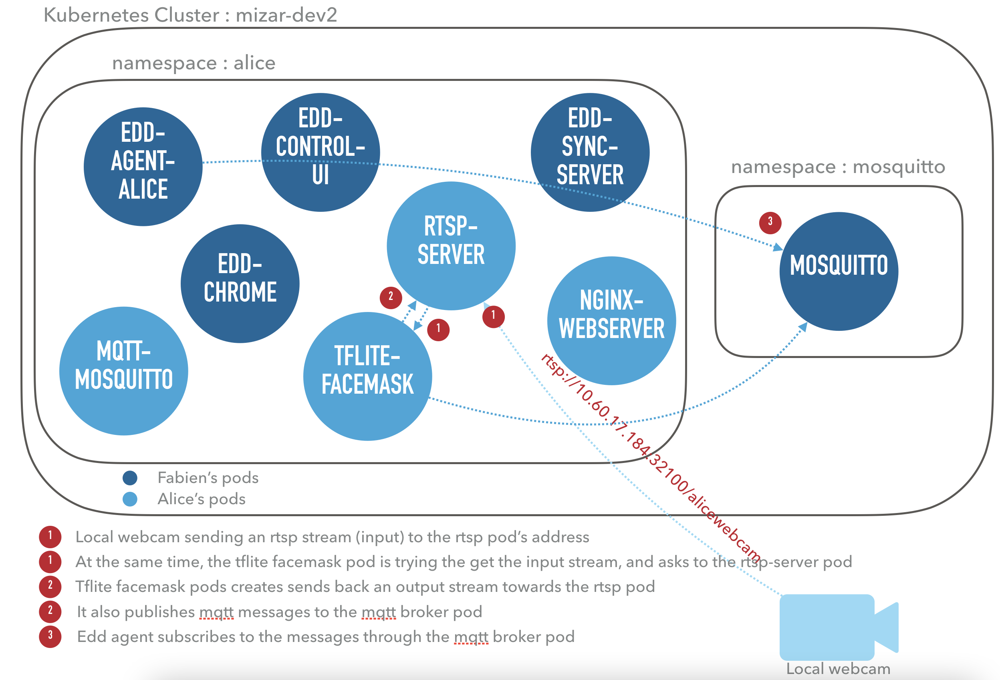
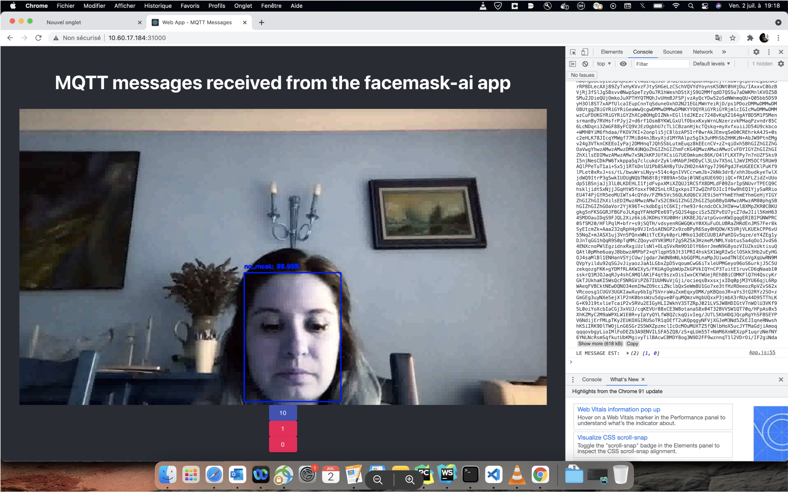
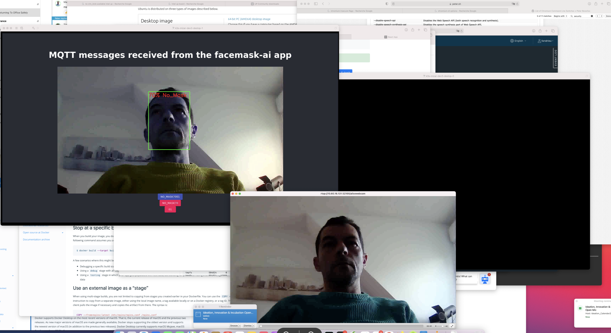

# <p align="center"> ⚜️ Alcor ISV Application Deployment ⚜️ </p>

### <p align="center"> Documentation for the integration of the facemask inference AI-engine into a k3s cluster, and packaged as an Helm Chart </br> </p>

## Ressources 
### **References to the Github codes:**
1. https://wwwin-github.cisco.com/apagnoux/mqtt-webclient-app.git
2. https://wwwin-github.cisco.com/apagnoux/facemask-detectionV3-fixed.git
3. https://wwwin-github.cisco.com/AppEdge/tflite-coral-tpu

## Descritpion of the codes content
The first code refers to the Nginx Webserver and the UI-related files (React) that it serves. It also contains the deployments and services for building the following pods:
- mqtt-broker
- rtsp
- tpu version of the AI facemask

The current working version is "harbor.eticloud.io/gbear-dev/nginx-react-265app:0.0.7" 


The second code is the code for AI facemask software version. It contains its deployment and service files for integrating its pod into a kubernetes cluster. Helm Charts (just for the facemask) have been added to the repo 
- software version of the AI facemask
- Helm Charts : https://wwwin-github.cisco.com/apagnoux/facemask-detectionV3-fixed/tree/master/ai-facemask-chart
- Commands </br>
    -```helm install my-ai-facemask-chart ai-facemask-chart/ --values ai-facemask-chart/values.yaml  ``` </br>
    -```export POD_NAME=$(kubectl get pods --namespace default -l "app.kubernetes.io/name=facemask-app,app.kubernetes.io/instance=my-ai-facemask-chart" -o jsonpath="               {.items[0].metadata.name}")``` </br>
    -```export CONTAINER_PORT=$(kubectl get pod --namespace alice $POD_NAME -o jsonpath="{.spec.containers[0].ports[0].containerPort}")```


    

The current working version is "harbor.eticloud.io/gbear-dev/facemask-detectionv2:0.0.10"
</br>

<details><summary><b>Show instructions</b></summary>
1. On a terminal, start the input rstp stream towards the cluser's rtsp pod ip address:

    ffmpeg -f avfoundation -framerate 30 -video_size 1280x720 -i "0:none" -f rtsp -rtsp_transport tcp rtsp://10.60.17.184:32100/alicewebcam
  

</br>
You can change the version of the docker image previously built for the nginx pod that serves the UI. 
1. Login to Great Bear's harbor 
  
    docker login --username='robot$gbear-dev+gbear-dev-ci' --password='xIepEYlDsXmEFYayyvVZRej4aQfFlXRq'  harbor.eticloud.io/gbear-dev

</br>
2. Don't forget to build your docker image ! 

    docker build -t <your-image-name> .
    example : docker build -t facemask-detectionv2:0.0.10 .

</br>
3. Tag your image

    docker tag facemask-detectionv2:0.0.10  harbor.eticloud.io/gbear-dev/facemask-detectionv2:0.0.10 


</br>
4. Push it to harbor

    docker push harbor.eticloud.io/gbear-dev/facemask-detectionv2:0.0.10
</br>
5. Feel free to change the reference to your image directly in both deployments 
    
    For nginx : https://wwwin-github.cisco.com/apagnoux/mqtt-webclient-app/blob/2795dda446751d7e046c902544588e3cce058e77/deployment.yaml#L70
    For the software facemask : https://wwwin-github.cisco.com/apagnoux/facemask-detectionV3-fixed/blob/307995ca402478912cd53217db5739bcd451af93/deployment.yaml#L22
</br>
6. Finally, configure the deployments after changing the image's name 
    kubectl apply -f deployment.yaml -n alice 
</details>

</br> </br>

The last code link refers to the tpu-compatible version of the facemask AI app. The deployment and the service associated to it are in located here :
- https://wwwin-github.cisco.com/apagnoux/mqtt-webclient-app/blob/2795dda446751d7e046c902544588e3cce058e77/deployment.yaml#L107
- https://wwwin-github.cisco.com/apagnoux/mqtt-webclient-app/blob/2795dda446751d7e046c902544588e3cce058e77/service.yaml#L62
The final image in harbor is harbor.eticloud.io/gbear-dev/tflite:0.0.8

_--Schema of this global architecture--_


_--Results--_



## Helm Charts

Code for the nginx charts : https://wwwin-github.cisco.com/apagnoux/helm-chart-nginx
(Local repository name: helm-test ```helm install example1 /Users/apagnoux/Downloads/helm-test --set service.type=NodePort```  )

Code for ai-facemask charts: https://wwwin-github.cisco.com/apagnoux/helm-chart-ai
(Local repository name: helm test-ai, ```helm install example2 /Users/apagnoux/Downloads/helm-test-ai```)


